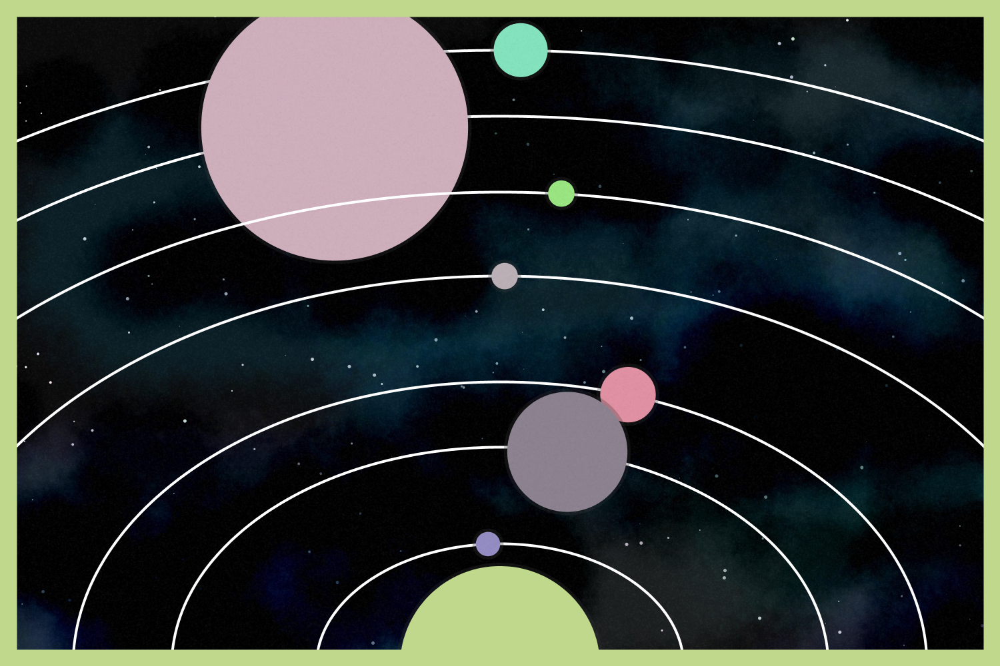

# processing
Playing with Processing and Python.

## Solar System
Starting to play with generative art. Uses a nice (but super slow) technique for creating the nebula splotches. This was inspired by a couple of Eric Davidson's ([Github](https://github.com/erdavids), [YouTube](https://www.youtube.com/channel/UCUrmX3SvpPerq-KAfGBrgGQ)) examples of [watercolours](https://github.com/erdavids/WatercolorClouds) and [solar system](https://github.com/erdavids/Generative-Space-System).

## Dots
I quite liked the dot pattern I saw in [this repo](https://github.com/aaronpenne/generative_art/tree/master/dots) from Aaron Penne ([Github](https://github.com/aaronpenne)) and wanted to have a go at something similar myself.

I tried doing something interactive with mouse tracking, so the light point followed the mouse cursor, but ended up with some rather gross blocky artifact so gave up on that idea.

Instead I had a go at bumbling my way through different types of circle packing using a grid system, and experimenting with dense packing (didn't look so good) and different varieties of sparse packing (limiting number of circles per cell and limiting the total area used by circles in each cell).
