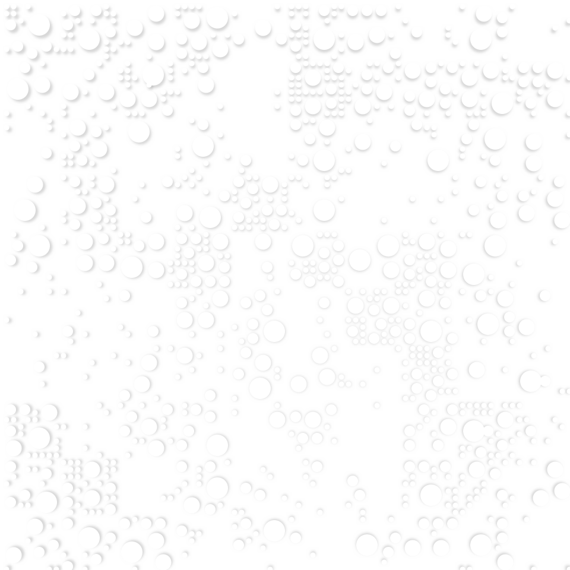

# processing
Playing with Processing and Python.

## Solar System
Starting to play with generative art. Uses a nice (but super slow) technique for creating the nebula splotches. This was inspired by a couple of Eric Davidson's ([Github](https://github.com/erdavids), [YouTube](https://www.youtube.com/channel/UCUrmX3SvpPerq-KAfGBrgGQ)) examples of [watercolours](https://github.com/erdavids/WatercolorClouds) and [solar system](https://github.com/erdavids/Generative-Space-System).

I have since modified the method the nebula were created by using PGraphics to allow for blurring and blending of clouds to create highlights and holes in the main nebula, which has worked out quite well. The stars added a nice finishing touch to the scene. Unless I decide to play with asteroid belts, this will probably finish here.

## Dots
I quite liked the dot pattern I saw in [this repo](https://github.com/aaronpenne/generative_art/tree/master/dots) from Aaron Penne ([Github](https://github.com/aaronpenne)) and wanted to have a go at something similar myself.

I tried doing something interactive with mouse tracking, so the light point followed the mouse cursor, but ended up with some rather gross blocky artifact so gave up on that idea.

Instead I had a go at bumbling my way through different types of circle packing using a grid system, and experimenting with dense packing (didn't look so good) and different varieties of sparse packing (limiting number of circles per cell and limiting the total area used by circles in each cell).

## Triangles
This is my first attempt at something purely from scratch without trying to replicate someone else's ideas on my own. I started out by choosing a square cell, placing a triangle in it and gradually decaying (chance for a triangle to be present, as well as alpha value) radiating triangles, randomly choosing opposing quadrants to draw the triangle. This gave some nice results but I wanted to work on the idea more, so I introduced rules as the triangles radiated (based off the idea of cellular automata) whereby the position of a triangle and its colour were influenced (but not absolutely determined) by those of its neighbours.

Just for fun I thought I'd draw circles inside some of the triangles, which was a good exercise in learning about incircles. Finally, I added some texture to the background in the form of parallel lines of random lengths.

## Deform Experiments
Investigating different options with playing with the deforming algorithm. Instead of always using octagons, can generate n-sided polygons, and can randomise blending modes and blur values.

## Sheep
My mum bought my eldest daughter a set of pyjamas recently which had a sheep pattern on them. It was simple line drawings, and I figured I'd try and emulate it in Processing. Whilst this isn't perfect (the quadratic curves I used for the feet are a bit gross), and there's some work to do yet (it's fixed scale right now), I think it's looking OK so far.

## Image Processing with Shapes
With an earlier program I was having a go at getting pixel colour values of an image. Processing keeps these in a *pixels* array, which is all well and good, but the values stored in the array come across as ints, which you then need to interrogate using red(), green() and blue() functions to isolate the colour values, which is a bit of a pain.

This program was just getting used to working with this by analysing a loaded JPG or PNG image, breaking it into regions and average colours, and then drawing shapes (started out with squares, then circles) into each region filled with the calculated colour. This looked nice, but not very exciting, so I thought about randomising the shape. I plugged in the deform n-sided polygon class I had written earlier, and used these, with some size variation and multiple layers of transparent shapes, which ended up looking pretty interesting.

## Trees
I know tree generation algorithms have been a Thing forever, but I thought it was a fun exercise in thinking about how I'd do it from scratch. Since I've really liked how the deforming algorithm worked for shapes, I've re-used that for the bushy leaves at the end of branches.

It'd be nice to get some practice drawing curves and make a version of this which was not quite so blocky at the branch joins, with a smoother transition between line lengths.

